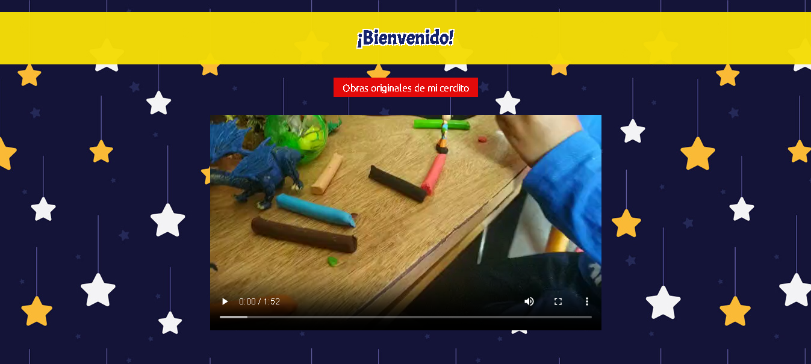
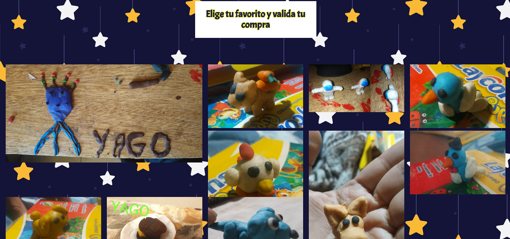
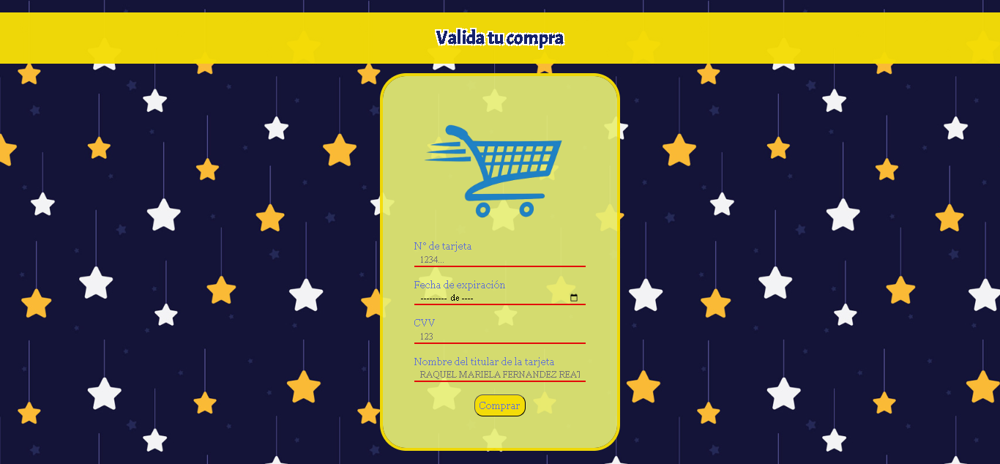

# Tarjeta de crédito válida

## Índice

* [1. Card Validation - Tienda de esculturas](#-Card Validation - Tienda de esculturas)
* [2. Diseño](#-Diseño)
* [3. Modo de uso](#-Modo de uso)
* [4. Consideraciones generales](#-Consideraciones generales)
* [5. Tecnologías usadas](#-Tecnologías usadas)
***

## 1. Card Validation - Tienda de esculturas

Este es un sitio para compras esculturas hechas con plastilina cuenta con un video del proceso, una galeria de las esculturas y otra página de formulario para validar la compra en la cual se utilizo ell algorimo de Luhn.

## 2. Diseño

Para el diseño se tomaron colores divertidos que se evoquen a un niño jugando, se hizo responsive design para que pueda ser vasto en tablet y celeulares porque es el formato que más consumen los niños.

## 3. Modo de uso

El usuario al llegar a la página puede observar un video de bienvenida en donde se muestra el proceso de creación de la esculturas, luego en la galeria escoje el producto que desea y ve su precio, al hacer click en la imagen lo lleva al formulario donde puede valdar su compra.

## 4. Consideraciones Generales

 En los cmpos del fomulario hay restricciones para validar la tarjeta de credito y tambien se agrego el imput month para que solo se peda poder mes y año en la fecha de experación de la tarjeta.

## 5. Tecnologías usadas
Este sitio web fue construido utilizando las siguientes tecnologías: HTML5 y CSS3 para marcado, estilo y dinamismo y JavaScript(JS) para valiación e interactividad.
